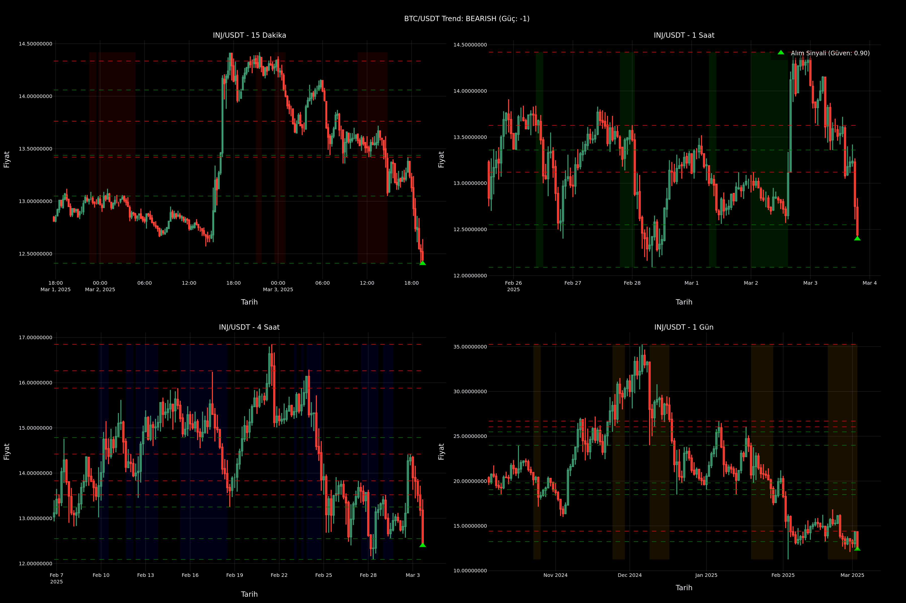

# TTM-Fibonacci Gradient Trading Scanner v2 for Binance

[English version below](#crypto-technical-analysis-scanner)

## 🇹🇷 Türkçe

### Proje Hakkında
Bu proje, Binance borsası için geliştirilmiş, TTM Squeeze ve Fibonacci gradyan analizi kullanan otomatik bir kripto para tarama sistemidir. Sistem, çoklu zaman dilimlerinde analiz yaparak potansiyel alım-satım fırsatlarını tespit eder ve görselleştirir.

### Özellikler
- Çoklu zaman dilimi analizi (15dk, 1sa, 4sa, 1gün)
- Fibonacci gradient hesaplaması
- TTM Squeeze göstergesi desteği
- Multiprocessing ile paralel analiz
- Otomatik grafik oluşturma ve kaydetme
- Yüksek hacimli coinlere odaklanma
- Detaylı teknik analiz grafikleri

### Gereksinimler
```bash
pip install ccxt pandas numpy plotly python-dotenv nest-asyncio kaleido tqdm
```

### Kurulum
1. Projeyi klonlayın:
```bash
git clone https://github.com/ruthlessgoldie/Ttm-fibgradient_binance.git
cd Ttm-fibgradient_binance
```

2. `.env` dosyasını oluşturun ve Binance API anahtarlarınızı ekleyin:
```env
BINANCE_API_KEY=your_api_key
BINANCE_API_SECRET=your_api_secret
```

### Kullanım
1. Jupyter Notebook'u başlatın:
```bash
jupyter notebook
```

2. `ttm&fib.ipynb` dosyasını açın ve çalıştırın

### Çıktılar
- Her coin için detaylı teknik analiz grafikleri (PNG formatında)
- Konsol çıktısında sinyal özetleri
- Zaman damgalı dosya isimleri

---

## 🇬🇧 English

# Advanced TTM-Fibonacci Gradient Trading Scanner v2 for Binance

## About the Project
This project is an advanced cryptocurrency scanning system developed for Binance exchange, utilizing TTM Squeeze, Fibonacci gradient analysis, support/resistance levels, and market correlation analysis. The system analyzes multiple timeframes to identify and visualize potential trading opportunities with increased accuracy.

### Features
- Multi-timeframe analysis (15m, 1h, 4h, 1d)
- Enhanced Fibonacci gradient calculation
- TTM Squeeze indicator support
- Support and Resistance level detection
- Market correlation with BTC trends
- Signal confidence scoring
- Parallel analysis with multiprocessing
- Auto-generated detailed technical charts
- Focus on high-volume coins

### Requirements
```bash
pip install ccxt pandas numpy plotly python-dotenv nest-asyncio kaleido tqdm scipy
```

### Installation
1. Clone the project:
```bash
git clone https://github.com/ruthlessgoldie/Ttm-fibgradient_binance.git
cd Ttm-fibgradient_binance
```

2. Create `.env` file and add your Binance API keys:
```env
BINANCE_API_KEY=your_api_key
BINANCE_API_SECRET=your_api_secret
```

### Usage
1. Start Jupyter Notebook:
```bash
jupyter notebook
```

2. Open and run `ttm&fib.ipynb`

### Technical Details

#### Enhanced Analysis Methods
- **Fibonacci Analysis**: Advanced gradient calculation using Fibonacci retracement levels
- **TTM Squeeze**: Identifies potential breakout points using Bollinger Bands and Keltner Channels
- **Support/Resistance Detection**: Identifies key price levels using local minima/maxima
- **Market Correlation**: Analyzes BTC trend influence on altcoin signals
- **Signal Confidence Scoring**: Weighted scoring based on multiple factors
- **Multi-Timeframe Confirmation**: Requires consistent signals across timeframes

#### New Features
1. **Support/Resistance Analysis**
   - Dynamic level detection
   - Minimum touch point validation
   - Automatic grouping of nearby levels
   - Visual representation on charts

2. **Market Correlation**
   - BTC trend analysis
   - Signal confidence adjustment based on market leader
   - Trend strength measurement
   - RSI correlation

3. **Enhanced Visualization**
   - Support/Resistance lines on charts
   - Confidence level indicators
   - Market trend annotations
   - Color-coded signals based on confidence

#### Performance Optimizations
- Efficient parallel processing
- Smart memory management
- Optimized data structures
- Robust error handling
- Rate limiting protection

### Example Output
```
=== SUMMARY ===
Total signals found for 41 coins:

TFUEL/USDT Signal Summary:
✓ 15 Minutes: Buy (-83.27) [Confidence: 0.85]
✓ 1 Hour: Buy (-95.90) [Confidence: 0.92]
✓ 4 Hours: Buy (-80.17) [Confidence: 0.88]
✓ 1 Day: Buy (-85.54) [Confidence: 0.90]

Market Trend: BULLISH (Strength: 2)
Support Levels: 0.123, 0.119
Resistance Levels: 0.145, 0.152
```

### Advanced Chart Features
- Support and resistance level visualization
- Market trend indicators
- Confidence level markers
- TTM Squeeze zones
- Multiple timeframe analysis
- Custom color schemes for different signals

### License
MIT License

### Contact
Project Link: [https://github.com/ruthlessgoldie/Ttm-fibgradient_binance](https://github.com/ruthlessgoldie/Ttm-fibgradient_binance)

---

## 📊 Screenshot

