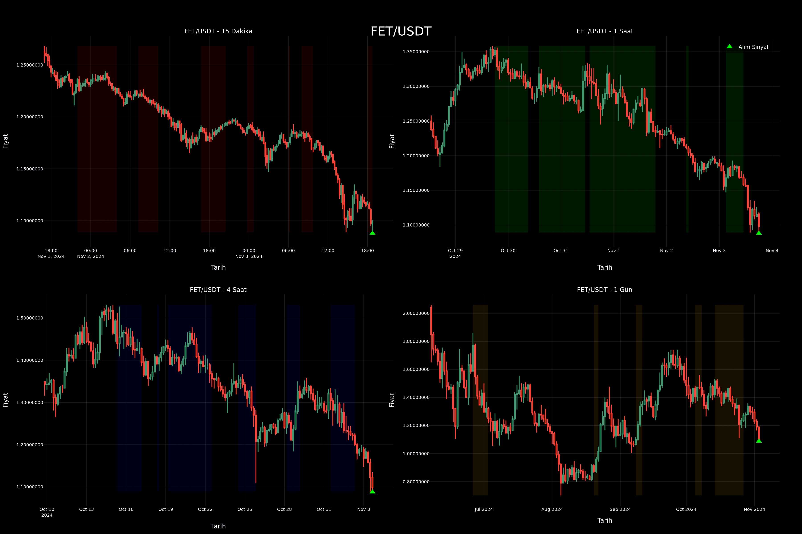

# TTM-Fibonacci Gradient Trading Scanner for Binance

[English version below](#crypto-technical-analysis-scanner)

## 🇹🇷 Türkçe

### Proje Hakkında
Bu proje, Binance borsası için geliştirilmiş, TTM Squeeze ve Fibonacci gradyan analizi kullanan otomatik bir kripto para tarama sistemidir. Sistem, çoklu zaman dilimlerinde analiz yaparak potansiyel alım-satım fırsatlarını tespit eder ve görselleştirir.

### Özellikler
- Çoklu zaman dilimi analizi (15dk, 1sa, 4sa, 1gün)
- Fibonacci gradient hesaplaması
- TTM Squeeze göstergesi desteği
- Multiprocessing ile paralel analiz
- Otomatik grafik oluşturma ve kaydetme
- Yüksek hacimli coinlere odaklanma
- Detaylı teknik analiz grafikleri

### Gereksinimler
```bash
pip install ccxt pandas numpy plotly python-dotenv nest-asyncio kaleido tqdm
```

### Kurulum
1. Projeyi klonlayın:
```bash
git clone https://github.com/ruthlessgoldie/Ttm-fibgradient_binance.git
cd Ttm-fibgradient_binance
```

2. Gerekli paketleri yükleyin:
```bash
pip install -r requirements.txt
```

3. `.env` dosyasını oluşturun ve Binance API anahtarlarınızı ekleyin:
```env
BINANCE_API_KEY=your_api_key
BINANCE_API_SECRET=your_api_secret
```

### Kullanım
1. Jupyter Notebook'u başlatın:
```bash
jupyter notebook
```

2. `ttm&fib.ipynb` dosyasını açın ve çalıştırın

### Çıktılar
- Her coin için detaylı teknik analiz grafikleri (PNG formatında)
- Konsol çıktısında sinyal özetleri
- Zaman damgalı dosya isimleri

---

## 🇬🇧 English

### About the Project
This project is an automated cryptocurrency scanning system developed for Binance exchange, utilizing TTM Squeeze and Fibonacci gradient analysis. The system analyzes multiple timeframes to identify and visualize potential trading opportunities.

### Features
- Multi-timeframe analysis (15m, 1h, 4h, 1d)
- Fibonacci gradient calculation
- TTM Squeeze indicator support
- Parallel analysis with multiprocessing
- Automatic chart generation and saving
- Focus on high-volume coins
- Detailed technical analysis charts

### Requirements
```bash
pip install ccxt pandas numpy plotly python-dotenv nest-asyncio kaleido tqdm
```

### Installation
1. Clone the project:
```bash
git clone https://github.com/ruthlessgoldie/Ttm-fibgradient_binance.git
cd Ttm-fibgradient_binance
```

2. Install required packages:
```bash
pip install -r requirements.txt
```

3. Create `.env` file and add your Binance API keys:
```env
BINANCE_API_KEY=your_api_key
BINANCE_API_SECRET=your_api_secret
```

### Usage
1. Start Jupyter Notebook:
```bash
jupyter notebook
```

2. Open and run `ttm&fib.ipynb`

### Technical Details

#### Analysis Methods
- **Fibonacci Analysis**: Calculates gradient using Fibonacci retracement levels
- **TTM Squeeze**: Identifies potential breakout points using Bollinger Bands and Keltner Channels
- **Multi-Timeframe Confirmation**: Requires signals across all timeframes for validation

#### Performance Optimizations
- Parallel processing using Python's multiprocessing
- Efficient memory management
- Optimized data structures
- Error handling and recovery

### Example Output
```
=== ÖZET / SUMMARY ===
Toplam 3 coin için sinyal bulundu / Signals found for 3 coins:

BTC/USDT Sinyal Özeti / Signal Summary:
✓ 15 Dakika / 15 Minutes: Alış / Buy (-72.15)
✓ 1 Saat / 1 Hour: Alış / Buy (-71.89)
✓ 4 Saat / 4 Hours: Alış / Buy (-73.42)
✓ 1 Gün / 1 Day: Alış / Buy (-70.95)
```

### License
MIT License

### Contact
Project Link: [https://github.com/ruthlessgoldie/Ttm-fibgradient_binance](https://github.com/ruthlessgoldie/Ttm-fibgradient_binance)

---

## 📊 Screenshot
